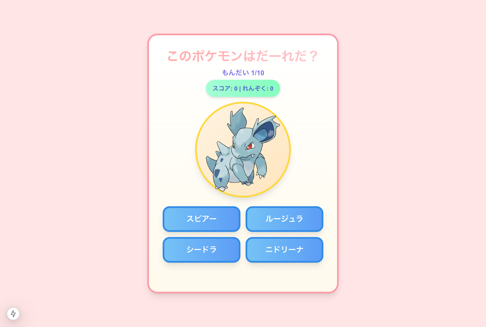

# ポケモンクイズアプリ

ポケモンの姿を見て名前を当てるクイズゲームです。PokeAPI を使用して、ランダムなポケモンの画像と選択肢を表示します。

https://pokemon-quiz-gxhllszbh-w712915s-projects.vercel.app/



## 機能

- ランダムなポケモンのクイズ出題
- スコアと連続正解数のトラッキング
- アニメーションつきの結果表示
- レスポンシブデザイン
- 最高連続正解記録の保持

## 技術スタック

- [Next.js 14](https://nextjs.org/) - React フレームワーク
- [TypeScript](https://www.typescriptlang.org/) - 型安全な開発
- [Tailwind CSS](https://tailwindcss.com/) - スタイリング
- [PokeAPI](https://pokeapi.co/) - ポケモンデータの取得

## 開発環境のセットアップ

```bash
# リポジトリのクローン
git clone https://github.com/w712915/pokemon-quiz.git

# プロジェクトディレクトリに移動
cd pokemon-quiz

# 依存関係のインストール
npm install

# 開発サーバーの起動
npm run dev
```

ブラウザで [http://localhost:3000](http://localhost:3000) を開いてアプリケーションを確認できます。

## プロジェクト構造

```bash
pokemon-quiz/
├── src/
│ ├── app/ # Next.js アプリケーションコード
│ │ ├── api/ # API ルート
│ │ ├── styles/ # CSS スタイル
│ │ └── page.tsx # メインページ
│ ├── components/ # React コンポーネント
│ │ ├── StartScreen.tsx # スタート画面
│ │ ├── QuizScreen.tsx # クイズ画面
│ │ ├── EndScreen.tsx # 終了画面
│ │ └── LoadingScreen.tsx # ローディング画面
│ └── types/ # TypeScript 型定義
├── public/ # 静的ファイル
└── package.json # プロジェクト設定
```

## 主なコンポーネント

- **StartScreen**: ゲーム開始画面を表示
- **QuizScreen**: クイズの問題と選択肢を表示
- **EndScreen**: ゲーム終了時のスコアと結果を表示
- **LoadingScreen**: データ読み込み中の表示

## API エンドポイント

- `GET /api/pokemon`: ランダムなポケモンとその選択肢を取得

## スタイリング

- Tailwind CSS を使用したモダンな UI デザイン
- カスタムアニメーション（フロート、正解/不正解エフェクトなど）
- レスポンシブデザインで様々な画面サイズに対応

## 今後の改善予定

- [ ] ローカルストレージを使用したハイスコアの保存
- [ ] 難易度選択機能の追加
- [ ] 音声効果の追加
- [ ] ポケモンのタイプによるフィルタリング
- [ ] 多言語対応

## ライセンス

このプロジェクトは MIT ライセンスの下で公開されています。

## 謝辞

- [PokeAPI](https://pokeapi.co/) - ポケモンのデータを提供
- ポケモンは株式会社ポケモン/任天堂の登録商標です。

## 作者

[w712915](https://github.com/w712915)
